<picture>
  <source media="(prefers-color-scheme: dark) and (max-width: 600px)" srcset="./assets/profile-dark-mobile.svg">
  <source media="(max-width: 600px)" srcset="./assets/profile-light-mobile.svg">
  <source media="(prefers-color-scheme: dark)" srcset="./assets/profile-dark.svg">
  
</picture>

  <a href="https://github.com/david20040406000-hue?tab=repositories"><b>探索我的專案 ↗</b></a>
  &nbsp;&nbsp; / &nbsp;&nbsp;
  <a href="#screeps-empire-ai"><b>Screeps 演算法 ↓</b></a>

---

我對自主決策、策略演算法與系統設計感興趣。讓程式觀察環境、分配資源，並在有限的運算預算中持續運作。

### Screeps Empire AI

**自主代理系統 · JavaScript · 私人專案**

以 Screeps 為實作場域，將資源分配、空間規劃與運算限制整合進模組化決策系統。

| 設計重點 | 實作方向 |
| :--- | :--- |
| **任務調度** | 結合優先度與距離評分，為單位動態分配工作。 |
| **空間規劃** | 以雙向掃描的距離變換評估基地選址。 |
| **CPU 預算** | 透過每 tick 共用快取與分層執行條件，管理運算開銷。 |

原始碼維持私人；此處展示系統架構與演算法方向。

About this profile · 關於這個首頁

以原創 SVG 製作動畫名片，支援深色、淺色與手機版面。開場文字逐步顯示，搭配軌道動畫與流動線條；啟用系統「減少動態效果」時顯示靜態內容。

視覺靈感來自 [Dstnexe 的終端機式個人首頁](https://github.com/Dstnexe/Dstnexe)。此處的版面、圖形和產生程式另行撰寫。動畫皆為視覺裝飾。

